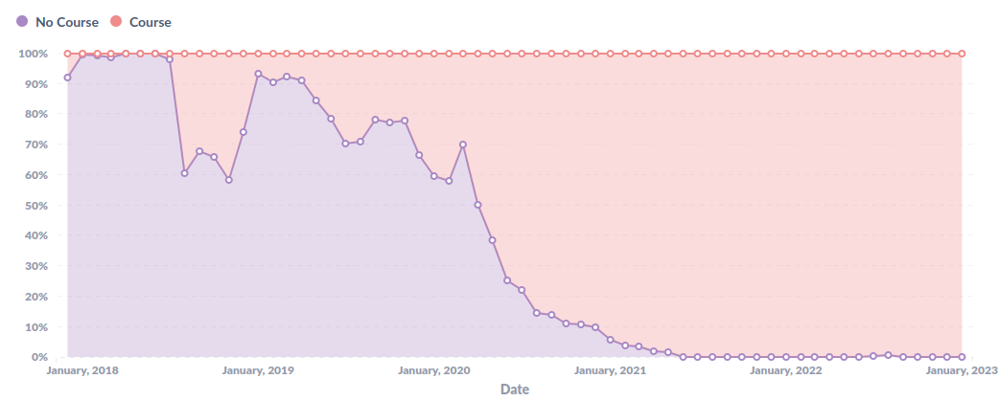

# Counting users

This document describes:

 * [The history of the metric](#history)
   * This includes the conclusion that **the current definition of `billable` 
   users is a bug**
 * [General features of a metric you might want](#features)
 * [A summary of ways of counting users with respect to those features](#summary)
 * [Details of those ways of counting methods](#details)
   * [Users who have annotated in the period](#metric-annotate-in-period)
   * [Users who have launched in the period (`active`)](#metric-active)
   * [Users in a group which someone has launched in the period (`billable`)](#metric-billable)
   * [Users in a group which someone has annotated in the period (`billable_new`)](#metric-billable-new)
   * [Users in a group which someone has been annotated 20 times (`lms_students_unique_ay_current`)](#metric-billable-lms-students-unique-ay-current)
 * [Further reading about historical choices about this topic](#further-reading)

<a id="history" />

## History of the metric

Originally the most relevant metric was called `lms_students_unique_ay_current`
which calculated users in a group which someone has been annotated at least 20 
times. There were other variants of this metric which calculated over different
periods of time.

This is the metric calculated by the Jon U system and used to be fed to 
Hubspot.

### February 2022

Around February 2022 we started a project to replace the metrics being fed to
Hubspot with a new product Sparky. At this time each of the metrics was 
discussed and the consensus seemed to be:

 * The desired metric is to count users who launch us (`active`)
 * But we didn't capture the data at that time
 * Therefore, we would count users who were in a group with one annotation as a
 stop gap (`billable_new`)

### April 2022

Around April 2022 Sparky took over from Jon U as the system which reported into
Hubspot. At this time the `billable_new` metric took effect.

In Hubspot this metric is called `lms_users_last_academic_year` (there are
others over different periods of time).

### October 2022

Around October 2022 we started a project to replace our internal reporting in
Metabase with a more performant and reliable system. During this time we 
attempted to calculate the same metric but **due to a coding error the metric
was unintentionally changed to all activity** rather than requiring one 
annotation.

This metric is what's described in this document as `billable`.

### 28th November 2022

On the [28th of November 2022](https://github.com/hypothesis/report/pull/106)
the new Report system took over from Sparky as the source of data going into
Hubspot. At this time the metric in Hubspot called
`lms_users_last_academic_year` (and others) **unintentionally changed** from
the `billable_new` metric to the `billable` metric.

The change was not noticed.

### Present day (January 2023)

Members of the sales and success teams became concerned with the metric as it
seems to over-report numbers.

In response to this I (Jon Betts) read over the new code to find the definition
of the current metric and described it as the `billable` metric. The difference
between the `billable` as described and the correct `billable_new` was not 
spotted by anyone.

This triggered the present discussion over the correct metric, at which 
point I began investigating the different alternative metrics to create this 
document. As a part of this I put together further reading list and researched
this history of the metric, at which point I discovered this is a bug.

### Conclusion

It's my conclusion that:

 * We have always wanted to move to `active` as the metric
 * However, we have been waiting on enough back-fill of data to make the switch
 * We settled on `billable_new` in the mean-time
 * **The current `billable` definition is a bug** and should be fixed

<a id="features" />

## Features you might want in a metric

### Stable

Events outside the time period cannot affect the _value_ of the metric within 
the time period. Once a number has been calculated it can be stored and remain 
true.

_e.g._

* **Stable**: People who were alive in 1901
* **Unstable**: Number of descendents of people who were alive in 1901

### Comparable

The metric can be meaningfully compared between different items and times. 
While you can compare anything, it's only meaningfull to compare 
numbers which were collected in the same way and mean the same thing.

_e.g._

 * **Comparable**: Number of people who live in pre-historic time to now
 * **Incomparable**: Number of people who live in pre-historic time to now 
    according to the census data

### Direct

The metric is directly measured, instead of inferred from other activity.

_e.g._

 * **Direct**: Counting the number of children someone has
 * **Inferred**: Using purchases of toys to infer someone has children

<a id="summary" />

## Summary of ways of counting users

| Short name                       | Stable | Comparable    | Direct | Calculable | Description                                                |
|----------------------------------|--------|---------------|--------|------------|------------------------------------------------------------|
| n/a                              | ✅      | ✅             | ✅      | Always     | Users who have annotated in the period                     |
| `active`                         | ✅      | ✅             | ⚠️     | 17/08/2022 | Users who have launched in the period                      |
| `billable`                       | ❌      | ❌ (✅ 06/2021) | ❌      | Always     | Users in a group which someone has launched in the period  |
| `billable_new`                   | ❌      | ⚠️            | ❌      | Always     | Users in a group which someone has annotated in the period |
| `lms_students_unique_ay_current` | ❌      | ❌             | ❌      | Always     | Users in a group which someone has been annotated 20 times |

<a id="details" />

## Details of ways of counting users

----

<a id="metric-annotate-in-period" />

### Users who have annotated in the period

 * Stable, comparable, direct
 * Calculable since: All time

**Stable**: Users who annotated in the period cannot inflate or divert numbers
from other periods of time. Each annotation is a single event which is counted
once.

**Comparable**: The meaning and rigorousness of collecting annotations has 
always been good as it is the core of our main product.

**Direct**: Users who annotated are getting value.

#### How is it done?

Not done at this time. We would take annotation dates by user and map those
users to organizations for this metric.

----

<a id="metric-active" />

### Users who have launched in the period (`active`)

 * Stable, comparable, direct?
 * Calculable since: 17th August 2022

**Stable** - Users who launched in the period cannot inflate or divert numbers
from other periods of time. Each launch is a single event which is counted
once.

**Comparable** - Only tracked from the 17th August 2022. All figures
before this time are zero and cannot be compared; after this date all 
figures are collected in the same way and can be compared.

**Direct?** - This is a direct metric if you count a launch as chargeable value 
delivered. It is indirect if you are using this as a proxy for something else.

#### How is it done?

Launch events in LMS are joined through `event_user` links to users. The events
allow us to get a time and join to an organization. We then calculate the 
unique users over each time period after matching them to `h` users.

So we require a recorded launch event, and an `event_user` link to know who did
it, which are only available since 17th August 2022.

----

<a id="metric-billable" />

### Users in a group which someone has launched in the period (`billable`)

 * Unstable, incomparable, indirect
 * Calculable since: All time
 * Comparable since: June 2021

**Unstable**: All metrics which work by counting users via a group are unstable
over time. Launching an old course will cause those users to be counted in
this year's numbers. Users who join a course which was created last year will
cause those years to be counted in last year's numbers.

**Incomparable**: Record keeping around events has changed significantly
over time. The following graph shows the percentage of launch event records 
which include a course:

The percentage has changed a lot over time, with more recent records 
more likely to contain a link to the course. Records without a course will not 
contribute to this metric.

This is due to some code paths recording values, others not. Over time the 
number of paths which record these values has increased, catching more 
activity.

 * Before June 2021 you cannot compare one customer to another
 * You cannot compare numbers for the same customer before and after June 2021
 * After June 2021 this metric is more or less fully comparable

**Indirect**: All metrics which work by counting users via a group are 
indirect as being in a group with an event does not mean the user derived any
value.

#### How is it done?

We take all event records which have a course listed, we then match our users
to `h` users and match our groups to `h` groups and use the `h.user_group` 
table to match users to those groups. This allows us to map from LMS courses
to `h` users.

We then calculate a `group_activity` table which includes matching launch 
events to those groups along with annotation counts (which are not used here).

We use these two pieces of data together, (mapping from groups to users and 
group activity) to pick all users in groups with any activity over the period.

----

<a id="metric-billable-new" />

### Users in a group which someone has annotated in the period (`billable_new`)

 * Unstable, comparable?, indirect
 * Calculable since: All time

**Unstable**: All metrics which work by counting users via a group are unstable
over time. Annotating an old course will cause those users to be counted in
this year's numbers. Users who join a course which was annotated last year will
cause those years to be counted in last year's numbers.

**Comparable?**: The meaning and rigorousness of collecting annotations has 
always been good as it is the core of our main product.

The size and nature of groups has changed over time, but when looking for a 
single annotation, the size of the group matters less. However, it is still
unfair to compare courses with small groups as the course requires only a 
single annotation to count, whereas each small group will require one to count
meaning a higher effective threshold for users with small groups.

**Indirect**: All metrics which work by counting users via a group are 
indirect as being in a group with an event does not mean the user derived any
value.

#### How is it done?

Not done at this time. This could be done in a similar way to `billable` above,
except we would limit events in the `group_activity` table which contain at 
least one annotation.

----

<a id="metric-billable-lms-students-unique-ay-current" />

### Users in a group which someone has been annotated 20 times (`lms_students_unique_ay_current`)

 * Unstable, incomparable, indirect
 * Calculable since: All time

**Unstable**: All metrics which work by counting users via a group are unstable
over time. Annotating an old course will cause those users to be counted in
this year's numbers. Users who join a course which was annotated last year will
cause those years to be counted in last year's numbers.

**Incomparable**: The meaning and rigorousness of collecting annotations has 
always been good as it is the core of our main product.

A similar story to counting a single annotation, except worse. A course with 
19 annotations will not count, but the same course with 10 small groups 
could conceivably have 190 and still not count. As a result you could get 
different results for the same number of annotations.

**Indirect**: All metrics which work by counting users via a group are 
indirect as being in a group with an event does not mean the user derived any
value.

#### How is it done?

Unknown. This is calculated by the legacy Jon U system.

<a id="further-reading" />

## Further reading

### Sparky "active" user calculation (Sparky code)

> The correct definition of "active" is that a user signed in during a
> period. We can't currently measure that, so instead we are compromising
> on the user being in a group which has at least one annotation in the
> period.

_https://github.com/hypothesis/sparky/blob/main/sparky/etl/hubspot_counts/aggregations.py#L54_

### The current calculation for Report (LMS code)

_https://github.com/hypothesis/lms/blob/main/lms/data_tasks/report/create_from_scratch/04_activity_counts/03_organization_activity/01_create_view.sql#L113_

### Define the required Hubspot report (Sparky ticket)

> Active - "belongs to a group with at least 1 annotation created in the 
> period."
> 
> The intent for active is "has signed in during the period." This is the 
> minimal amount of usage we want to charge for.

_https://github.com/hypothesis/sparky/issues/7_

### Change the billing definition of "active" (Harvestr ticket)

> To: any user that signs in
> ...
>  I've had everyone I've talked to so far agree on this idea.

_https://app.harvestr.io/components/0/m52KeZr162/1HvQ3Q0tB_

### Report billable active students and teachers by login (LMS ticket)

> We bill by user. Today we define billable as signing in. This way we can
> charge for:
> 
> * Teachers who never annotate
> * Students who never annotate, either because
>    * their teacher has created reading assignments and added footnotes, 
>    but not required students to actually annotate, or
>    * because they _should_ be using the app but aren't motivated enough to 
>    actually do the assignment.
> * And **not** charge for students who enrolled in a class but then dropped 
> out.

_https://github.com/hypothesis/lms/issues/3664_

### Existing metrics (Sparky implementation notes)

> `lms_students_unique_ay_current`
> 
> Question: What does ay mean here? - Academic year
> 
> Seems to be a count of students in groups with at least 20 annotations between
> some fixed dates.

https://github.com/hypothesis/sparky/blob/main/docs/hub_spot/implementation_notes/01_required_report.md
